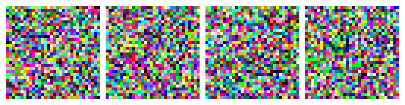
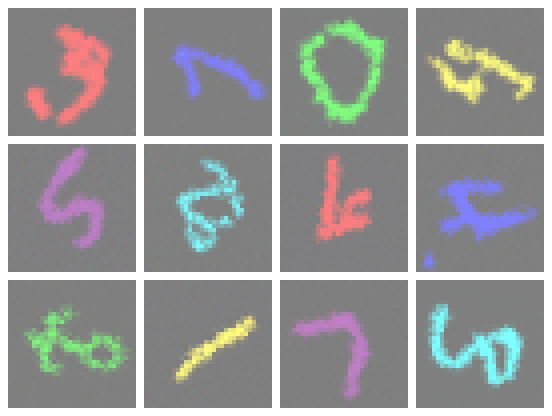

# Text-to-Image with Flow Matching

A small text-to-image generation model trained from scratch on a modified
version of MNIST (colored, rotated digits), using a **flow matching**
objective (rectified flow with a linear or cosine interpolation path)
instead of a classic DDPM-style diffusion process.

Given a caption such as `"a red 7 rotated 45 degrees"`, the model generates
a matching 32x32 RGB image.

<p align="center">
  
</p>
<p align="center">
  <em>Live denoising: four prompts (<code>a red 3 rotated 0 degrees</code>, <code>a blue 7 rotated 90 degrees</code>,
  <code>a green 0 rotated 180 degrees</code>, <code>a purple 5 rotated 270 degrees</code>) integrated from pure
  Gaussian noise (t=0) to the final image (t=1), 50 Euler steps.</em>
</p>

## How it works

1. **Synthetic dataset.** MNIST digits are tinted with a random color from a
   fixed palette and rotated by a random angle, and paired with an
   auto-generated caption (e.g. `"a blue 3 rotated 210 degrees"`). This
   gives a fully controllable text→image task without needing a real
   captioned image dataset.
2. **Text conditioning.** Captions are tokenized with a tiny fixed
   vocabulary (colors, digit words, digits, `"rotated"`, `"degrees"`) and
   encoded with a small Transformer encoder into a sequence of embeddings.
3. **Image model.** A U-Net with residual blocks predicts a velocity field,
   conditioned on the text embeddings via cross-attention and on the flow
   timestep via sinusoidal embeddings injected into each residual block.
4. **Flow matching objective.** Instead of predicting noise (like DDPM), the
   model is trained to regress the velocity `dx_t/dt` along a path between
   Gaussian noise `x0` and a real image `x1`:
   - `linear` path (rectified flow): `x_t = (1-t)*x0 + t*x1`, constant
     target velocity `x1 - x0`.
   - `cosine` path: trigonometric interpolation between `x0` and `x1`.
5. **Sampling.** Images are generated by integrating the learned velocity
   field from pure noise (`t=0`) to a clean image (`t=1`) with a simple
   Euler ODE solver over a configurable number of steps.

## Project structure

```
.
├── config.json          # all hyperparameters (model, training, flow matching)
├── requirements.txt
├── src/
│   ├── data.py           # MNISTModified dataset + caption tokenizer
│   ├── network.py         # text encoder + cross-attention U-Net (TextToImageModel)
│   ├── flow_model.py       # flow matching loss (compute_loss) and ODE sampling (sample)
│   ├── train.py             # training loop, TensorBoard logging, checkpointing
│   └── generate.py           # Gradio web app for interactive generation
└── report/                    # full write-up (methodology, results, figures)
    └── rapport.pdf
```

| File | Description |
|---|---|
| [src/data.py](src/data.py) | `MNISTModified` dataset (colorized + rotated MNIST) and the caption tokenizer/vocabulary. |
| [src/network.py](src/network.py) | Transformer text encoder + cross-attention U-Net (`TextToImageModel`). |
| [src/flow_model.py](src/flow_model.py) | Flow matching training objective (`compute_loss`) and ODE-based sampling (`sample`, `sample_with_steps`). |
| [src/train.py](src/train.py) | Training loop — TensorBoard logging, periodic sample previews, checkpoint saving. |
| [src/generate.py](src/generate.py) | Gradio web UI to generate images from a trained checkpoint. |

A detailed report (method, experiments, results) is available at
[report/rapport.pdf](report/rapport.pdf).

## Results

This is a small model (~0.5M parameters) trained for 20 epochs on a single
Mac, so outputs are blurry but consistently follow the requested color,
digit shape and rotation:

<p align="center">
  
</p>

## Installation

Requires Python 3.10+.

```bash
python3 -m venv .venv
source .venv/bin/activate
pip install -r requirements.txt
```

## Usage

All commands are run from the project root, as Python modules (so relative
imports inside `src/` resolve correctly).

### Train

```bash
python -m src.train
```

This will:
- automatically download MNIST into `data/` on first run,
- train the model according to `config.json`,
- log scalars and live sample previews to TensorBoard (launched
  automatically at `http://localhost:6006`),
- save a checkpoint to `checkpoints/model.pt` after every epoch.

### Generate images

Launch the interactive Gradio app once you have a trained checkpoint:

```bash
python -m src.generate --ckpt checkpoints/model.pt
```

Loading the model takes up to ~20 seconds and prints status messages while
it does — this is expected, wait for the `Running on local URL: ...` line.
Open that URL (typically `http://127.0.0.1:7860`), type a free-form prompt
(e.g. `"a green 0 rotated 180 degrees"`) or use the dropdown menus, and
watch the image denoise step by step.

## Configuration

All hyperparameters are centralized in [config.json](config.json):

| Section | Controls |
|---|---|
| `general` | image size/channels, batch size, embedding dims used across the model |
| `text_encoder` | Transformer encoder depth/heads for the caption encoder |
| `unet` | U-Net base channel width, time/context embedding dims |
| `flow_matching` | interpolation path (`linear` or `cosine`), number of sampling steps |
| `training` | epochs, batch size, learning rate, logging frequency, paths |

## Notes

- `data/` (downloaded MNIST) and `checkpoints/` are regenerated
  automatically and are not tracked in git (see `.gitignore`).
- Compute device is auto-detected in this order: MPS (Apple Silicon) → CUDA
  → CPU.
- Every core module (`data.py`, `network.py`, `flow_model.py`) has a
  runnable self-test in its `if __name__ == "__main__"` block, e.g.:
  ```bash
  python -m src.network
  python -m src.flow_model
  ```
